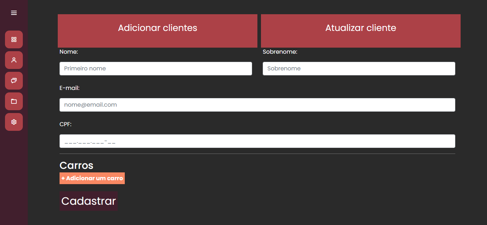
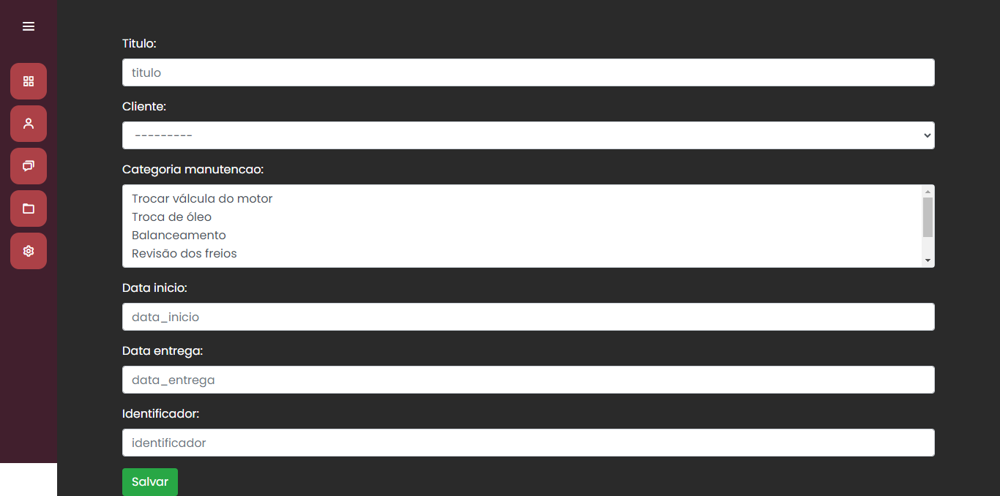
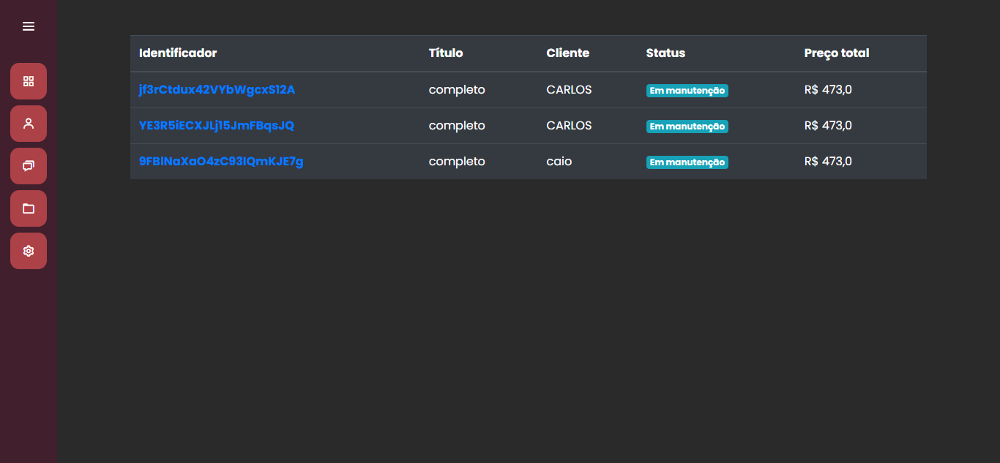

# Mecajato

Um sistema de ordens de serviço desenvolvido com Python e Django, usando SQLite como banco de dados. Os clientes podem selecionar serviços, como troca de óleo, definir a data de retirada e visualizar o valor. Os funcionários podem gerar PDFs com detalhes da ordem, como placa do veículo, nome do cliente e valor do serviço, usando a biblioteca fpdf.

  
  
  

## Descrição do Projeto

O projeto consiste em um sistema robusto de ordens de serviço, desenvolvido utilizando Python e Django, com integração ao banco de dados SQLite. Os clientes têm a liberdade de escolher entre uma ampla gama de serviços automotivos, desde simples trocas de óleo até serviços de manutenção mais complexos, podendo definir a data desejada para a realização do serviço e visualizar os custos estimados associados a cada opção.

Por outro lado, os funcionários têm acesso a uma interface intuitiva para gerenciar todas as ordens de serviço. Além disso, eles podem facilmente gerar documentos em formato PDF, que contêm detalhes completos sobre as ordens de serviço, como a placa do veículo, o nome do cliente e o valor do serviço prestado.

## Como Executar

1. Clone o repositório: `git clone git@github.com:matheusrodrigues1/mecajato.git`
2. Entre na pasta raiz do projeto: `cd mecajato`
3. Ative o 'venv': `venv\Scripts\Activate`
4. Rode o servidor: `python manage.py runserver`

## Autor

✉️: [Email](carlostech873@gmail.com) 
📄: [Currículo](https://drive.google.com/file/d/1Jfn9RAqFR3YaQbL8j_lJA0z8HHlLI3Xq/view?pli=1) 
💼: [Linkedin](https://www.linkedin.com/in/matheus-rodrigues-1a1899231/) 
📸: [Instagram](https://www.instagram.com/math.eusrrodrigues/)
